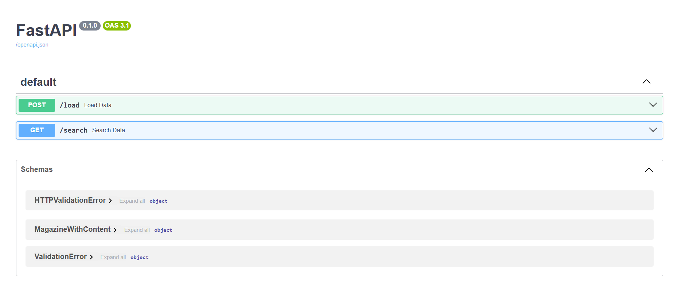
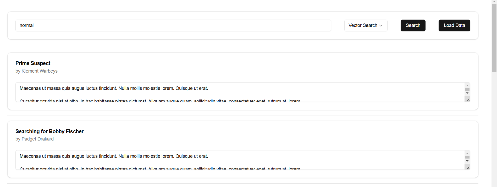

# Magazine Search

This application demonstrates a hybrid search implementation using FastAPI and Elasticsearch.

## Setup

### Backend

1. Clone the repository: `git clone https://github.com/taurusdcruz/magazine_search.git`
2. Navigate to the backend directory: `cd magazine_search/backend`
3. Create and activate a virtual environment.
4. Install the dependencies: `pip install -r requirements.txt`
5. Configure the environment variables:
    * Create a `.env.local` file in the `backend` directory.
    * Add your Elasticsearch Cloud ID, API Key, and Mockaroo API Key to the `.env.local` file.
6. Run the FastAPI application: `uvicorn main:app --reload`

### Frontend

1. Navigate to the frontend directory: `cd magazine_search/frontend`
2. Install the dependencies: `npm install`
3. Configure Tailwind CSS:
    * Install Tailwind CSS: `npm install -D tailwindcss postcss autoprefixer`
    * Generate Tailwind and PostCSS config files: `npx tailwindcss init -p`
    * Configure `tailwind.config.js` to include the paths to your template files and add the Shadcn plugin.
    * Add the Tailwind directives to your `globals.css` file.
4. Install Shadcn UI components: `npm install @shadcn/ui`
5. Run the shadcn CLI to initialize and add components:
    * `npx shadcn@latest init`
    * `npx shadcn@latest add button input card textarea separator select`
6. Run the Next.js application: `npm run dev`

## Backend Endpoints

*   `/load`: Loads data from Mockaroo and indexes it into Elasticsearch.
*   `/search`: Performs a search based on the specified search type.
*   `/docs`: Accesses the API documentation in FastAPI

## Search Types

*   **Full-Text Search:** Searches the `magazines` index using a `multi_match` query on the `title`, `author`, and `category` fields. This search type is case-insensitive and uses the standard analyzer with a lowercase token filter.
*   **Vector Search:** Searches the `magazine_contents` index using a `script_score` query with cosine similarity on the `vector_representation` field. This search type allows finding documents that are semantically similar to the search query.
*   **Hybrid Search (RRF):** Combines full-text and vector search using the `rrf` retriever with multiple retrievers. This search type leverages the strengths of both full-text and vector search to provide more relevant results.

## Using the Application

1.  Load data using the `/load` endpoint.
2.  Use the search bar in the frontend to perform a search.
3.  Select the search type from the dropdown menu.
4.  The search results will be displayed in cards.

